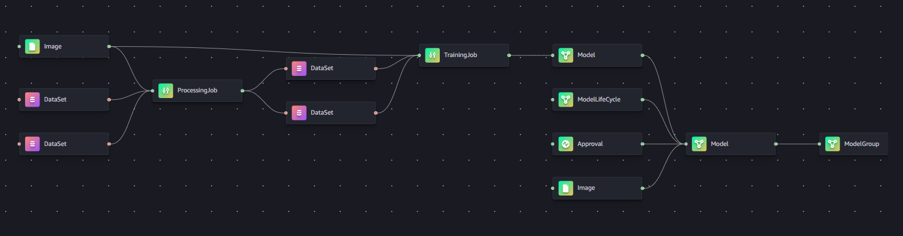
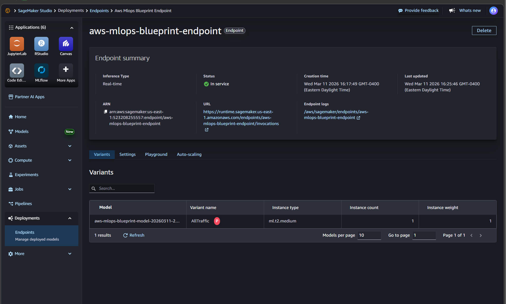
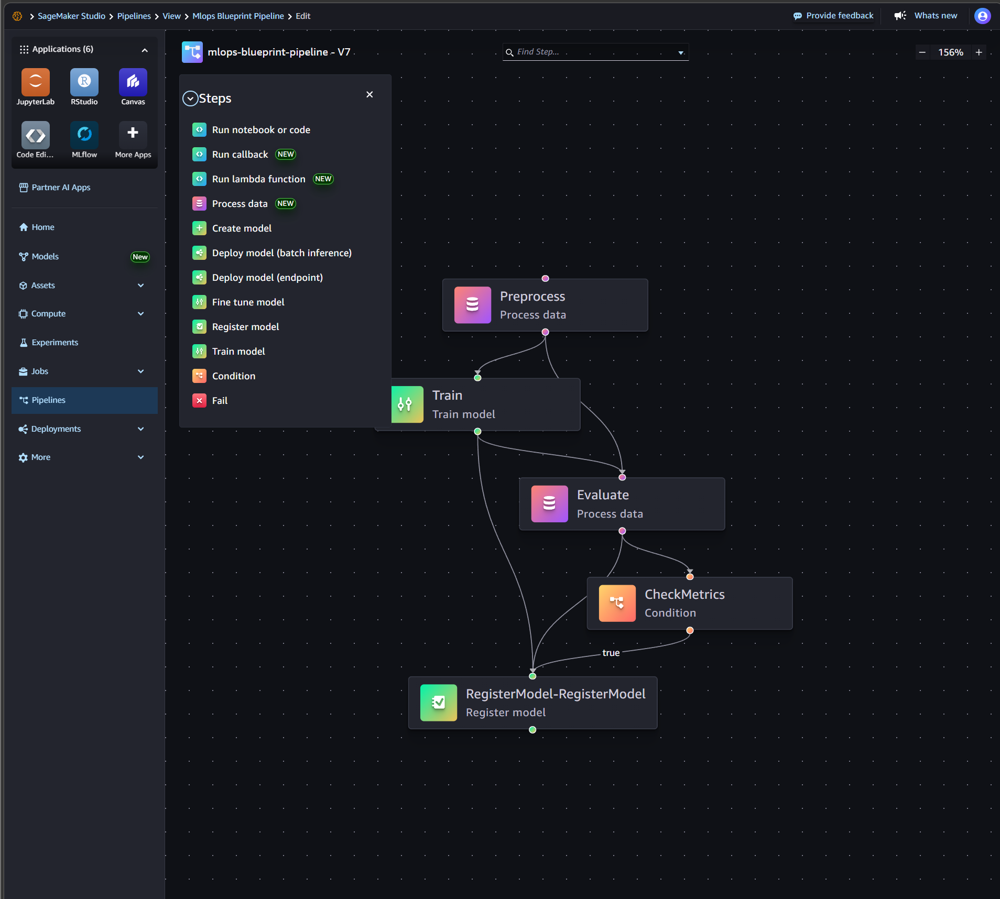
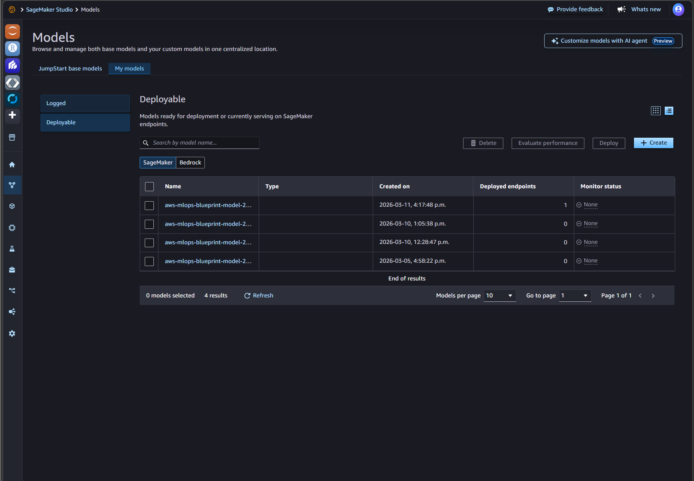
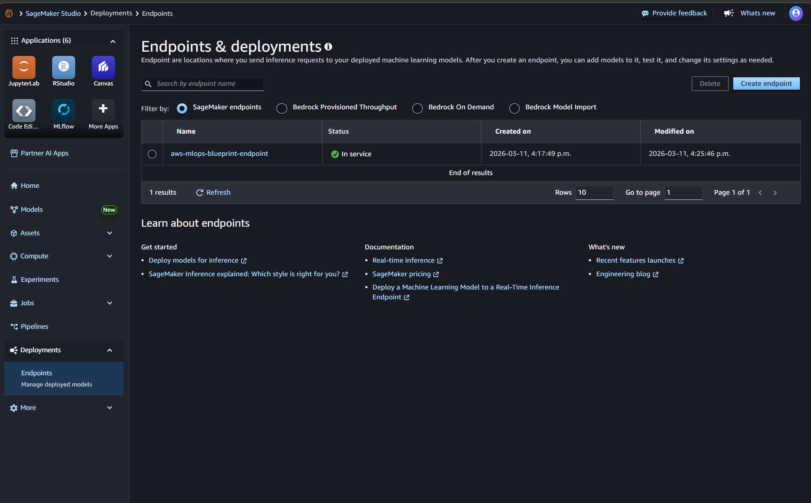
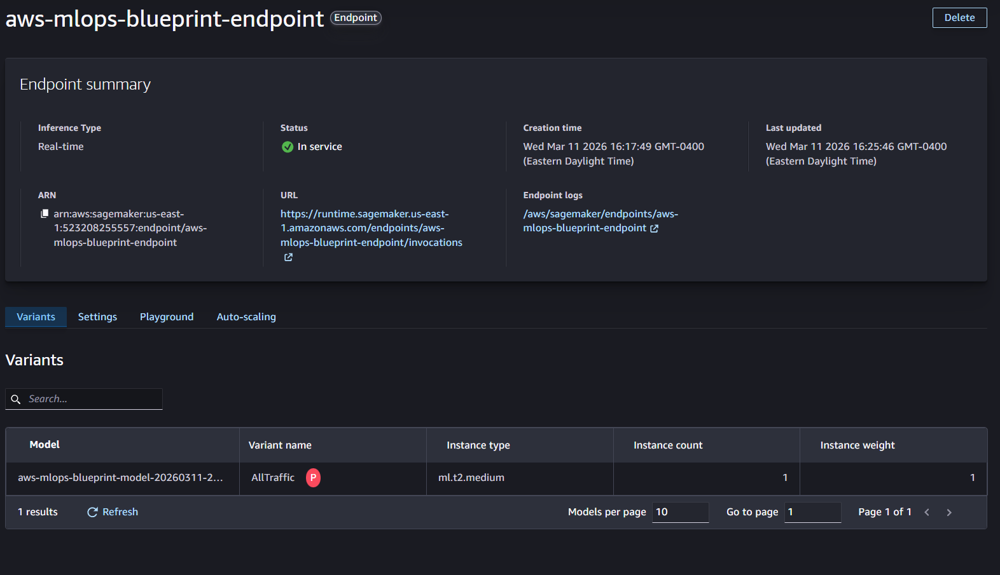

# AWS SageMaker MLOps Pipeline Template
**SageMaker Pipelines → Quality Gate → Model Registry → Real-time Endpoint → Drift Alarm**

This repo demonstrates a practical end-to-end MLOps workflow on AWS using **SageMaker Pipelines** and common production building blocks:

- Data in S3 → preprocess/split → train → evaluate
- A **quality gate** blocks/permits model promotion
- Passing models are versioned in **SageMaker Model Registry**
- Approved models are deployed to a **real-time endpoint**
- Basic drift monitoring: PSI metric → **CloudWatch Alarm → SNS email**
- 
🎥 **Video demo:** https://youtu.be/IdLPluh7-eo

---


## Why this project matters (portfolio summary)

This project proves I can ship a cloud ML workflow that includes orchestration, governance, deployment, and monitoring.

**Highlights**
- Built an end-to-end **SageMaker Pipeline** using the SageMaker Python SDK:
  - `ProcessingStep` (preprocess + train/val/test split)
  - `TrainingStep` (scikit-learn training job)
  - `ProcessingStep` (evaluation + metrics artifact)
  - `ConditionStep` (quality gate using macro F1)
  - `RegisterModel` (Model Registry versioning + metadata)
- Implemented deployment and ops workflows:
  - Registry approval (CLI or UI)
  - Endpoint deployment (data capture enabled)
  - Drift monitoring (PSI metric publishing + CloudWatch alarm + SNS alerts)
- Debugged real AWS constraints:
  - instance availability + quotas
  - model artifact formats (`model.tar.gz`)
  - CloudWatch log-driven troubleshooting

---

## Architecture


### Pipeline flow (high level)

```text
S3 Raw Data
  │
  ▼
Preprocess (ProcessingStep)
  - clean/split to train/val/test
  - outputs: S3 prefixes for train/val/test
  │
  ▼
Train (TrainingStep)
  - trains sklearn model
  - output: model.tar.gz in S3
  │
  ▼
Evaluate (ProcessingStep)
  - extracts model.tar.gz
  - computes macro_f1 + other metrics
  - output: evaluation.json in S3
  │
  ▼
CheckMetrics (ConditionStep)
  - if macro_f1 >= threshold → RegisterModel
  - else stop
  │
  ▼
RegisterModel (Model Registry)
  - creates model package version
  - approval status: PendingManualApproval (then you approve)

```


## Repo structure

```text
aws-mlops-blueprint/
├── infra/                   # CDK infra: S3 bucket, SageMaker role, SNS + alert rules (+ formatter)
├── scripts/                 # "one-command" scripts
│   ├── deploy.ps1           # deploy infra + upload data + build + run pipeline
│   ├── deploy-endpoint.ps1  # deploy latest approved model to endpoint
│   ├── monitor.ps1          # publish PSI metrics + ensure alarm exists
│   └── upload_data.ps1      # (optional) upload sample data only
├── ml/
│   └── sample_data.csv      # example dataset used by the pipeline
├── src/
│   ├── pipelines/           # DAG definition + execution trigger
│   ├── preprocess/          # preprocess + split
│   ├── train/               # training script
│   ├── evaluate/            # evaluation + metrics artifact
│   ├── deploy/              # registry approval + endpoint deployment
│   └── monitoring/          # alarms + PSI drift check
└── docs/
    ├── architecture.md
    ├── dataset.md
    ├── evaluation.md
    ├── api.md
    └── images/
        ├── 01_deploy_success.png
        ├── 02_pipeline_execution.png
        ├── 03_model_registry.png
        ├── 04_endpoint_inservice.png
        ├── 05_invoke_endpoint.png
        └── architecture.png
        
```


## -Prerequisites

- AWS CLI configured (aws sts get-caller-identity must work)
- Python 3.10+
- Node.js (for CDK in infra/)
- PowerShell (Windows) (optional: there is a deploy.sh for Linux/macOS if you choose to support it)

```text

Setup (recommended)
python -m venv .venv1
.\.venv1\Scripts\Activate.ps1
python -m pip install --upgrade pip setuptools wheel
pip install -r requirements.txt
```
✅ Important: this repo pins SageMaker SDK 2.x because sagemaker.workflow is required.

## One-command deploy (infra + pipeline run)

This deploys:

- S3 artifacts bucket
- SageMaker execution role
- SNS alerts + formatter + EventBridge rules
- uploads ml/sample_data.csv
- builds + runs the pipeline

```text
.\scripts\deploy.ps1 -Region us-east-1 -EmailForAlerts "prosperalabi7@gmail.com" -AlertsMode all
```


## Expected output:

- prints bucket name, role ARN, SNS topic ARN
- prints the pipeline execution ARN

📸 Screenshots:

docs/images/01_deploy_success.png

docs/images/02_pipeline_execution.png


## Model Registry

- List latest model packages:

```text
aws sagemaker list-model-packages `
  --model-package-group-name "mlops-blueprint-model-group" `
  --sort-by CreationTime `
  --sort-order Descending `
  --max-results 5 `
  --region us-east-1
```


## Approve a model package (example v3):

```text
python .\src\deploy\approve_model_package.py `
  --region us-east-1 `
  --model-package-arn "arn:aws:sagemaker:us-east-1:<ACCOUNT_ID>:model-package/mlops-blueprint-model-group/3" `
  --approval-status Approved `
  --approval-description "Approved via CLI"
```


📸 Screenshot: docs/images/03_model_registry.png

## Deploy endpoint (latest approved model)

- Deploy the most recent Approved package in the registry group to a real-time endpoint:

```text
.\scripts\deploy-endpoint.ps1 `
  -Region us-east-1 `
  -StackName MlopsBlueprintStack `
  -EndpointName aws-mlops-blueprint-endpoint `
  -InstanceType ml.t2.medium `
  -InitialInstanceCount 1 `
  -Wait

```

📸 Screenshot: docs/images/04_endpoint_inservice.png

## Invoke endpoint (API instructions)

- Create a payload:

```text
'{"instances":[[1.0,2.0,3.0],[4.0,5.0,6.0]]}' | Out-File -Encoding ascii payload.json
```


- Invoke:

```text
$ENDPOINT="aws-mlops-blueprint-endpoint"
$REGION="us-east-1"

aws sagemaker-runtime invoke-endpoint `
  --endpoint-name $ENDPOINT `
  --content-type "application/json" `
  --accept "application/json" `
  --body fileb://payload.json `
  out.json `
  --region $REGION

Get-Content out.json
```

- Expected output:

```text
{"predictions":[0,0]}
```

📸 Screenshot: docs/images/05_invoke_endpoint.png
- Full docs: [api.md](docs/api.md)

## Model evaluation

- The evaluation step writes evaluation.json to S3 under the pipeline execution prefix, e.g.:

```text
s3://<ARTIFACT_BUCKET>/mlops-blueprint-pipeline/<EXECUTION_ID>/Evaluate/output/evaluation/evaluation.json
```


### Metrics include:

- macro_f1
- plus additional sklearn classification metrics computed in src/evaluate/evaluate.py

Full docs: docs/evaluation.md

## Dataset explanation

### The dataset in ml/sample_data.csv is a small demo dataset with:

- 3 numeric features: f1, f2, f3
- label column: label
- Preprocess creates train/val/test splits and writes them to S3 under the pipeline execution prefix.

Full docs: [dataset.md](docs/dataset.md)


## Monitoring (drift + alarm)

### This repo includes a lightweight drift check that:

- loads baseline CSV from S3
- loads “recent” CSVs from an S3 prefix
- computes PSI per feature and overall
- publishes metrics to CloudWatch
- CloudWatch Alarm triggers SNS when threshold is breached

Run:
```text
.\scripts\monitor.ps1 -Region us-east-1 -Threshold 0.25
```

- Force an alarm (manual test)
```text
aws cloudwatch put-metric-data `
  --namespace "MLOpsBlueprint/Drift" `
  --metric-data "MetricName=OverallPSI_Max,Dimensions=[{Name=Project,Value=aws-mlops-blueprint}],Value=0.99" `
  --region us-east-1}
```


